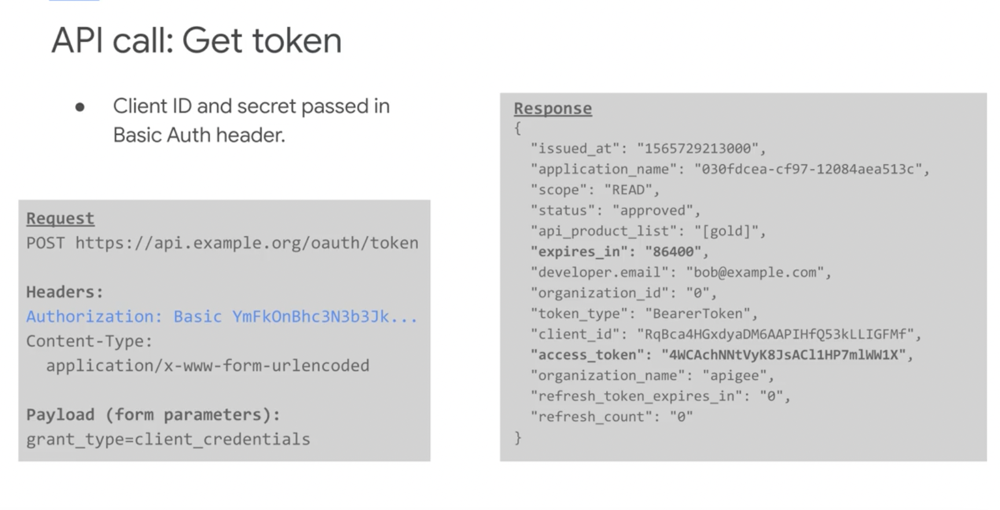
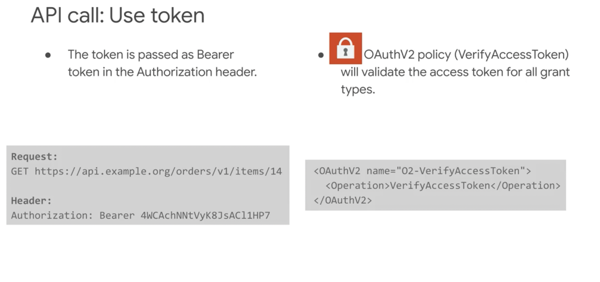

# OAuth Flow with Apigee Edge (API Management)

All flow listed here are currently only available with ApigeeEdge, running as a central entity, where every request has to run trough! Which means, that even traffic inside Azure or STACKIT needs to run via Apigee inside the Google cloud. That will raise the costs, because every request is now egress&ingress traffic from the corresponding Hyperscalers. Apigee Edge dokumentation is found here: https://docs.apigee.com/api-platform/get-started/get-started
In addition you can find the slides of the Apigee training here: [APISecurity-M1-AuthenticationAuthorizationAndOAuth](../apigateway/APISecurity-M1-AuthenticationAuthorizationAndOAuth.pdf)

##  Type of apps

##### Classify your app: public or confidential.

- Confidential apps can keep secrets confidential.

- Apps that are not confidential are considered public apps.

- Client-side web and native mobile apps are considered public apps.

##### Classify your app: trusted or untrusted. 

- First-party apps made by companies that already have full access to the user's data can be considered trusted apps.
- Third-party apps are untrusted.
- User credentials should never be entered into an unstressed app.

This will help you choose the OAuth grant type to use.

## OAuth grant types

| Grant Type                                                   | User Resources | DEPRECATED |Use Case                                                     |
| ------------------------------------------------------------ | -------------- | ------- | ------------------------------------------------------------ |
| [Client Credentials](https://oauth.net/2/grant-types/client-credentials/) | NO             | NO | System-to-system interactions Resources owned by a partner, not a specific user |
| [Authorization Code](https://oauth.net/2/grant-types/authorization-code/) | YES            | NO | Requesting app is NOT trusted Resources owned by the user |
| [Authorization Code - PKCE](https://oauth.net/2/pkce/) | YES            | NO | Requesting app is NOT trusted Resources owned by the user   PKCE (RFC 7636) is an extension to the Authorization Code flow to prevent CSRF and authorization code injection attacks.   PKCE is not a replacement for a client secret, and PKCE is recommended even if a client is using a client secret.   Note: Because PKCE is not a replacement for client authentication, it does not allow treating a public client as a confidential client.|
| [Implicit](https://oauth.net/2/grant-types/implicit/)        | YES            | YES |Designed for public browser-based or mobile apps **IMPLICIT NOT RECOMMENDED: USE Authorization Code instead** |
| [Password Grant](https://oauth.net/2/grant-types/password/) (Resource Owner Password) | YES | YES(*1) | Requesting app is trusted Resources owned by user The Password grant type is a way to exchange a user's credentials for an access token. Because the client application has to collect the user's password and send it to the authorization server, it is not recommended that this grant be used at all anymore. And is only feasible for trusted apps. **Should only be used for server-side OAuth flow!** |

More about OAuth grants: https://alexbilbie.com/guide-to-oauth-2-grants/

## OAuth Apigee Common Pattern

All of the grant types follow a common pattern.

The app determines a need for a token, requests a new token, and finally uses the token to gain access to the protected resource.

#### Typical Token creation used by APIGee

#### Typical Token usage with APIGee

