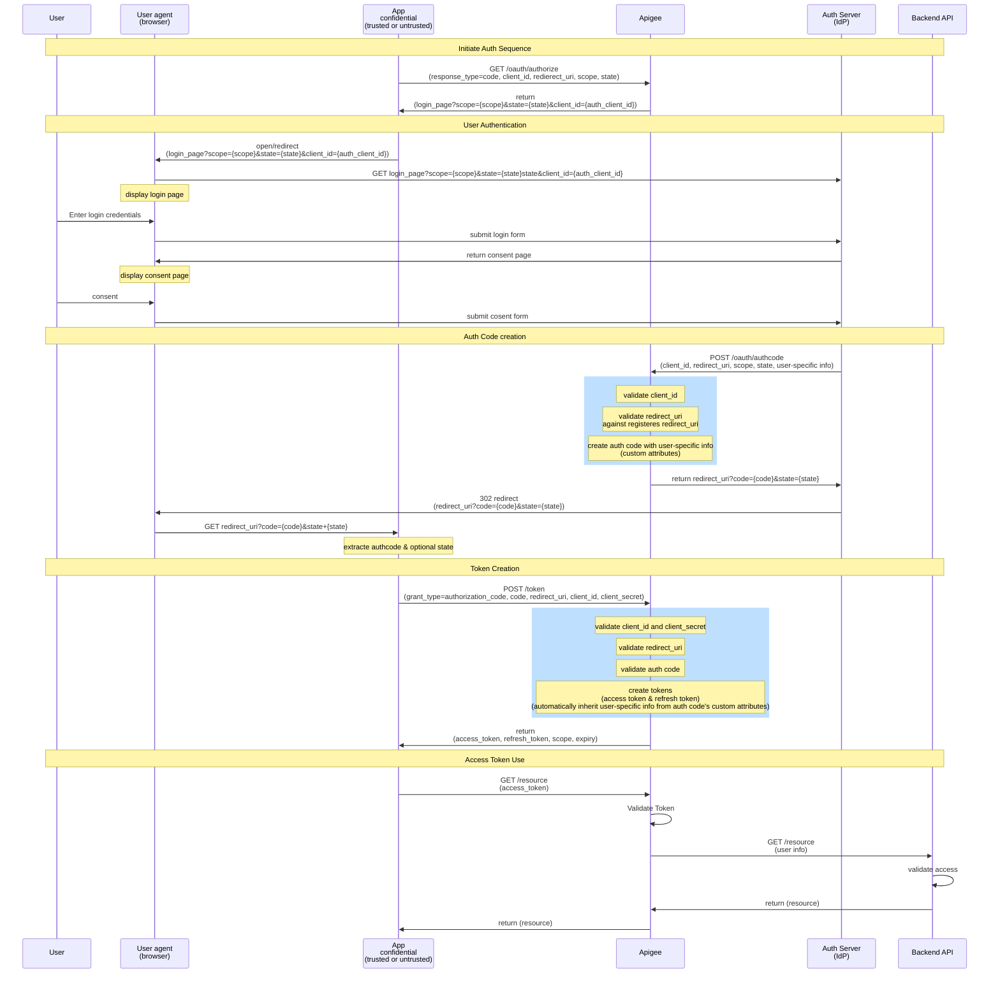
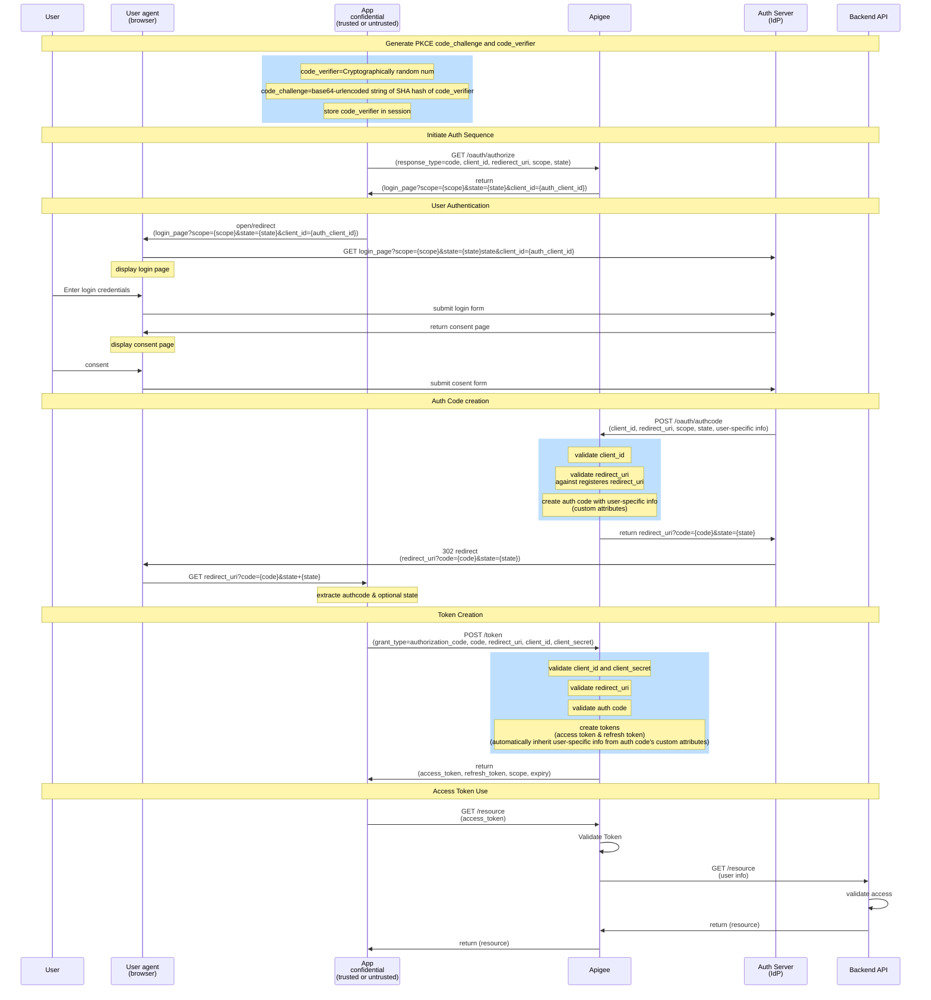

## Flow: [Authorization Code](https://oauth.net/2/grant-types/authorization-code/)

## Flow: Authorization Code with PKCE

- Use auth code for public clients
- Public clients cannot protect secrets.
- Auth code over https is safe, but mobile redirect with auth code may be compromised. How do we keep a compromised auth code from being exchanged for an access token?
- Proof Key for Code Exchange (PKCE):
	- Specified in RFC 7636
	- Uses cryptography to guarantee that the client exchanging the auth code for tokens also initiated the auth request

The problem with public clients is that they cannot safely store secrets. Mobile apps and client side JavaScript apps are examples of public clients.

The TLS communication used for OAuth is secure over the network, but the redirect on the mobile device may not be secure.

The redirect URL contains the auth code. If the auth code is compromised, how do we keep the bad actor from exchanging the auth code for an access token if we can't require a client secret?

The answer is that we use the OAuth extension called Proof Key for Code Exchange, known as PKCE. PKCE is specified in RFC 7636.

PKCE uses cryptography to guarantee that the client exchanging an auth code for tokens is the same client that started the original auth request.

