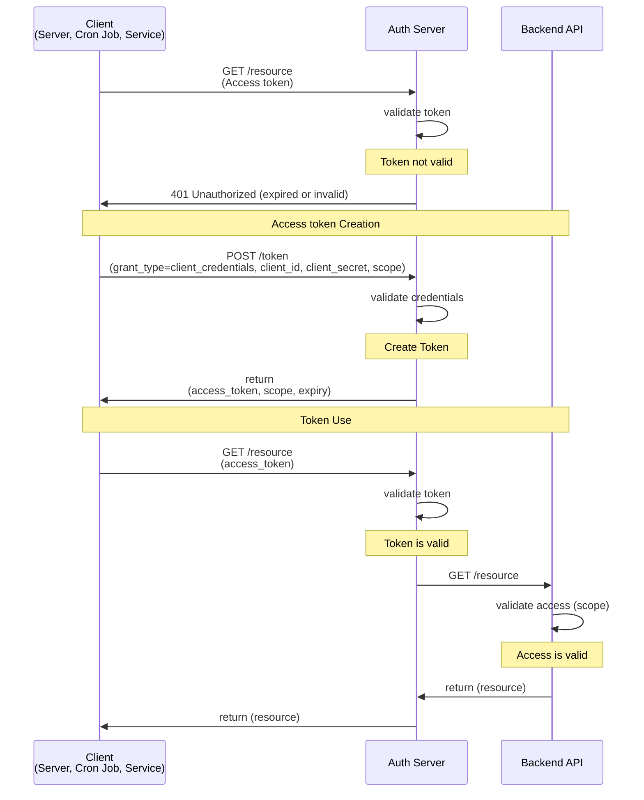
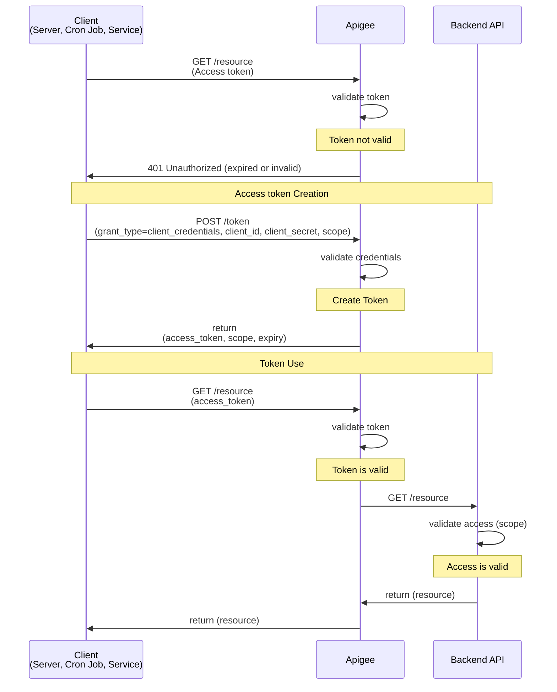
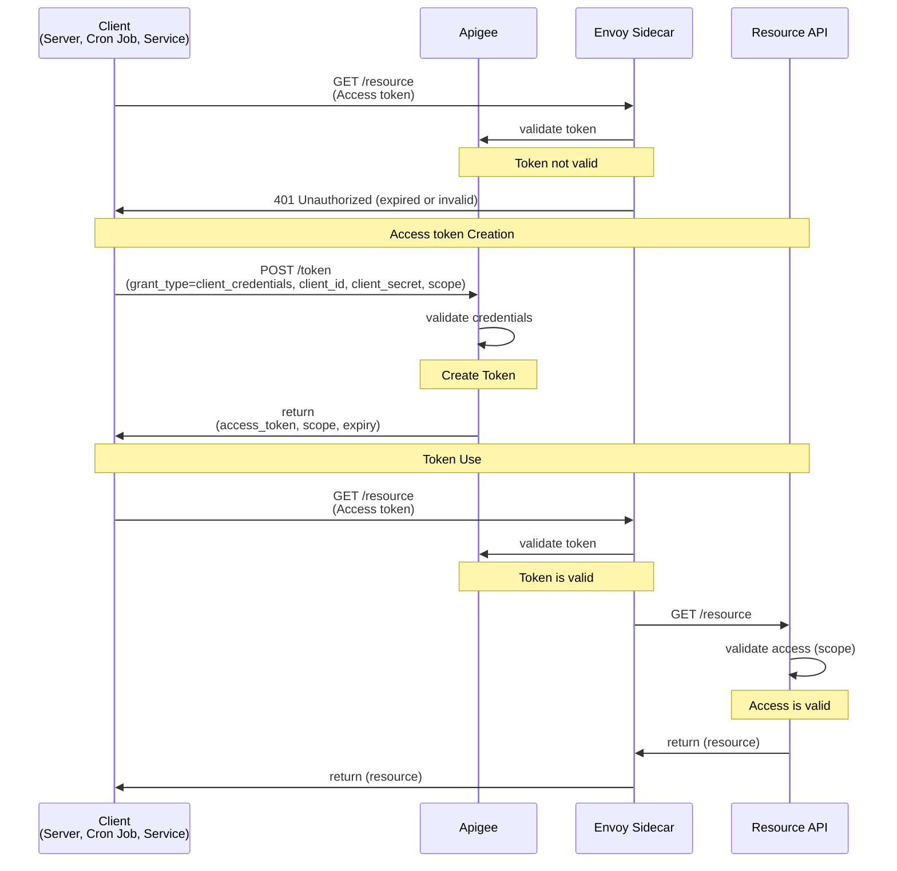
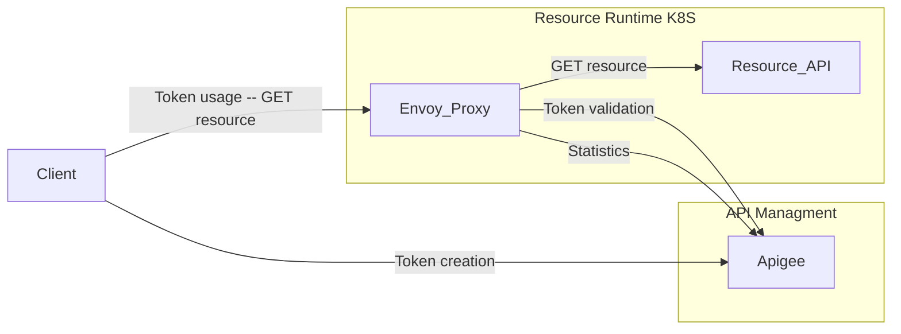

## Flow: Client credentials

With machine-to-machine (M2M) applications, such as CLIs, daemons, or services running on your back-end, the system authenticates and authorizes the app rather than a user. For this scenario, typical authentication schemes like username + password or social logins don't make sense. Instead, M2M apps use the Client Credentials Flow (defined in [OAuth 2.0 RFC 6749, section 4.4](https://tools.ietf.org/html/rfc6749#section-4.4)), in which they pass along their Client ID and Client Secret to authenticate themselves and get a token.

### Client credentials flow without Apigee

### Client credentials flow with Apigee

The flow with Apigee is identical, but Apigee is taking the role of the Auth Server.

### Client Credential flow with Apigee Edge & Envoy Proxy

Using the Envoy Proxy will remove the need to always call Apigee. In the case of a multi cloud scenario we will avvoid traffic betwenn the hyperscalers. Instead the traffic will stay inside the hyperscaler. 

