# OAuth Flow with Apigee Edge (API Management)

All flow listed here are currently only available with ApigeeEdge, running as a central entity, where every request has to run trough! Which means, that even traffic inside Azure or STACKIT needs to run via Apigee inside the Google cloud. That will raise the costs, because every request is now egress&ingress traffic from the corresponding Hyperscalers. Apigee Edge dokumentation is found here: https://docs.apigee.com/api-platform/get-started/get-started
In addition you can find the slides of the Apigee training here: [APISecurity-M1-AuthenticationAuthorizationAndOAuth](../apigateway/APISecurity-M1-AuthenticationAuthorizationAndOAuth.pdf)

##  Type of apps

##### Classify your app: public or confidential.

- Confidential apps can keep secrets confidential.

- Apps that are not confidential are considered public apps.

- Client-side web and native mobile apps are considered public apps.

##### Classify your app: trusted or untrusted. 

- First-party apps made by companies that already have full access to the user's data can be considered trusted apps.
- Third-party apps are untrusted.
- User credentials should never be entered into an unstressed app.

This will help you choose the OAuth grant type to use.

## OAuth grant types

| Grant Type                                                   | User Resources | DEPRECATED |Use Case                                                     |
| ------------------------------------------------------------ | -------------- | ------- | ------------------------------------------------------------ |
| [Client Credentials](https://oauth.net/2/grant-types/client-credentials/) | NO             | NO | System-to-system interactions Resources owned by a partner, not a specific user |
| [Authorization Code](https://oauth.net/2/grant-types/authorization-code/) | YES            | NO | Requesting app is NOT trusted Resources owned by the user |
| [Authorization Code - PKCE](https://oauth.net/2/pkce/) | YES            | NO | Requesting app is NOT trusted Resources owned by the user   PKCE (RFC 7636) is an extension to the Authorization Code flow to prevent CSRF and authorization code injection attacks.   PKCE is not a replacement for a client secret, and PKCE is recommended even if a client is using a client secret.   Note: Because PKCE is not a replacement for client authentication, it does not allow treating a public client as a confidential client.|
| [Implicit](https://oauth.net/2/grant-types/implicit/)        | YES            | YES |Designed for public browser-based or mobile apps **IMPLICIT NOT RECOMMENDED: USE Authorization Code instead** |
| [Password Grant](https://oauth.net/2/grant-types/password/) (Resource Owner Password) | YES | YES(*1) | Requesting app is trusted Resources owned by user The Password grant type is a way to exchange a user's credentials for an access token. Because the client application has to collect the user's password and send it to the authorization server, it is not recommended that this grant be used at all anymore. And is only feasible for trusted apps. **Should only be used for server-side OAuth flow!** |

More about OAuth grants: https://alexbilbie.com/guide-to-oauth-2-grants/

## OAuth Apigee Common Pattern

All of the grant types follow a common pattern.

The app determines a need for a token, requests a new token, and finally uses the token to gain access to the protected resource.

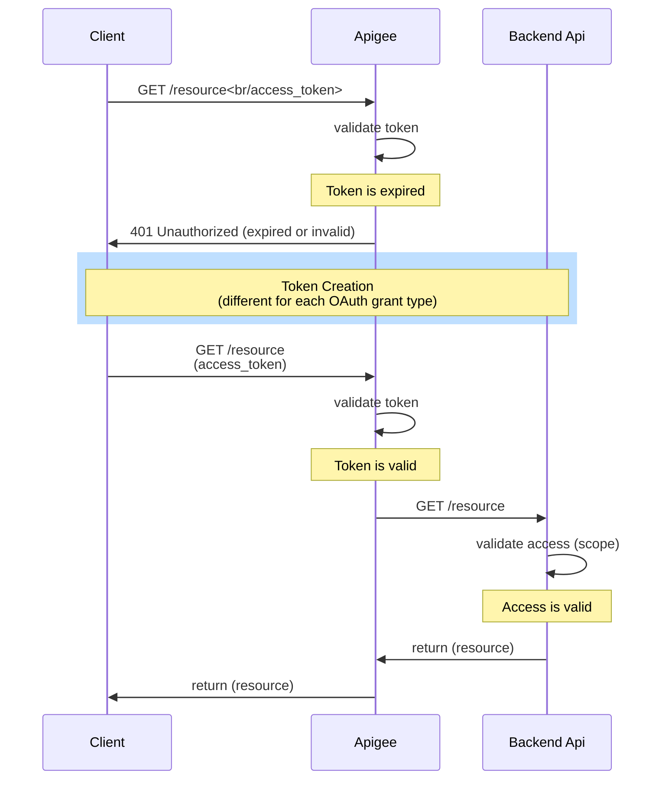

## Flow: Client credentials

With machine-to-machine (M2M) applications, such as CLIs, daemons, or services running on your back-end, the system authenticates and authorizes the app rather than a user. For this scenario, typical authentication schemes like username + password or social logins don't make sense. Instead, M2M apps use the Client Credentials Flow (defined in [OAuth 2.0 RFC 6749, section 4.4](https://tools.ietf.org/html/rfc6749#section-4.4)), in which they pass along their Client ID and Client Secret to authenticate themselves and get a token.

### Client credentials flow without Apigee

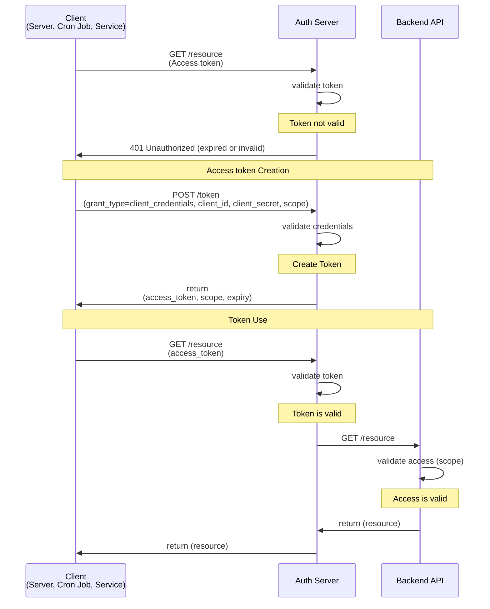

### Client credentials flow with Apigee

The flow with Apigee is identical, but Apigee is taking the role of the Auth Server.

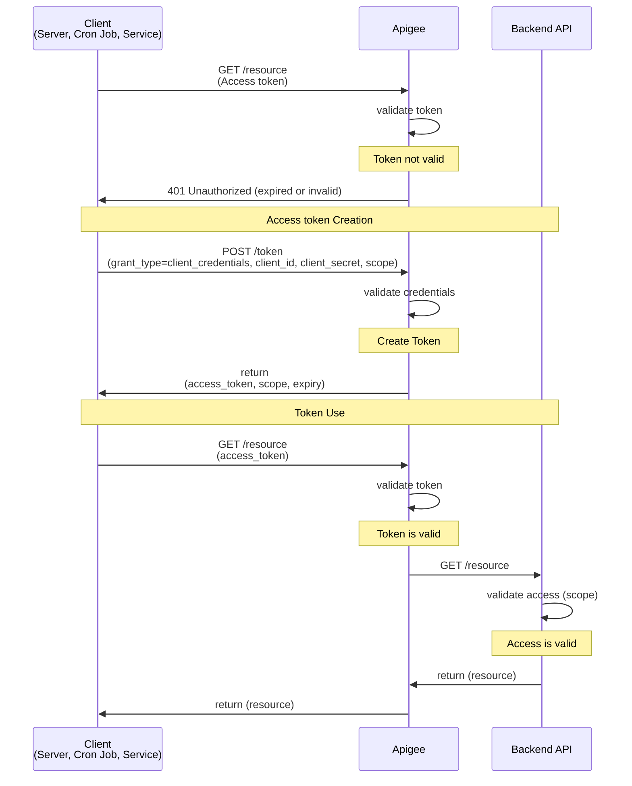

### Client Credential flow with Apigee Edge & Envoy Proxy

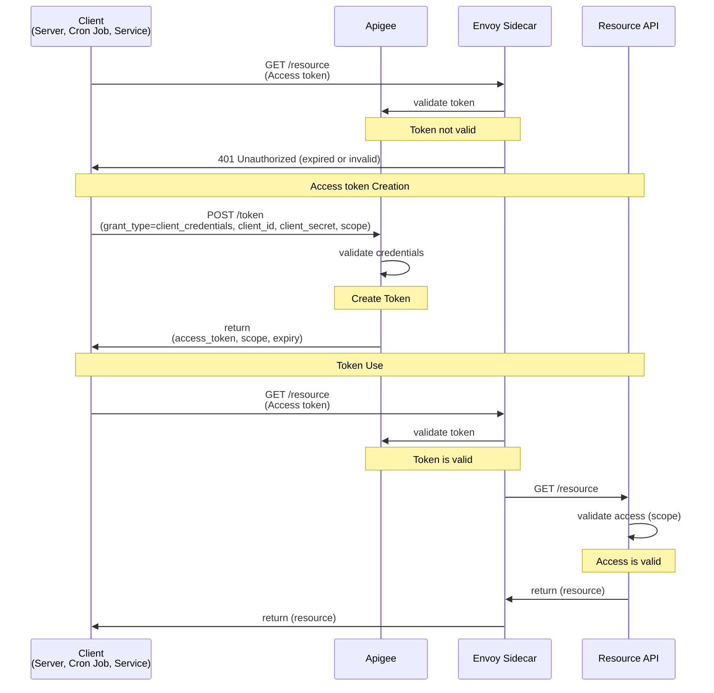

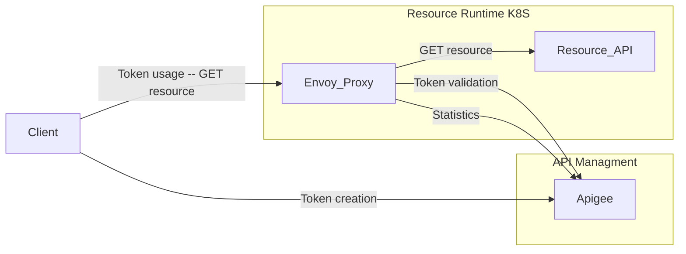

#### Typical Token creation used by APIGee

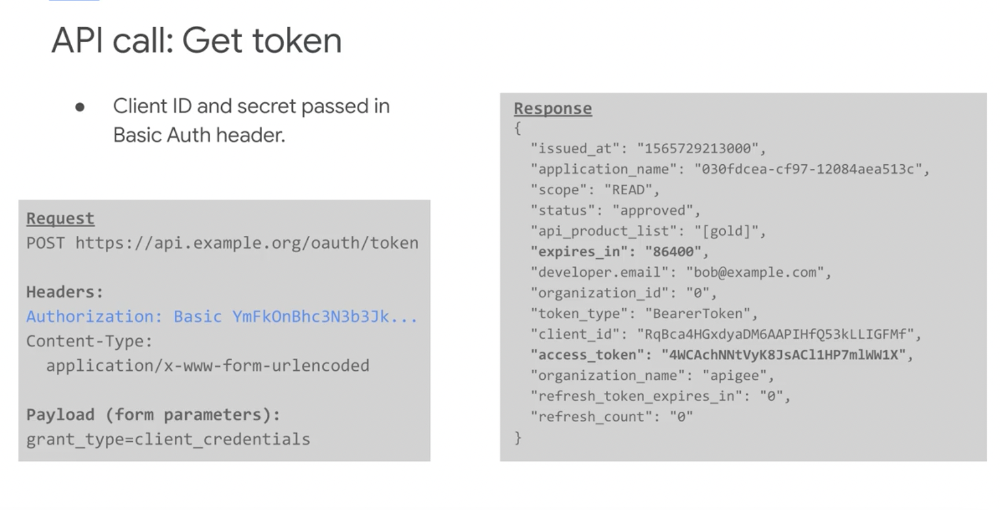

#### Typical Token usage with APIGee

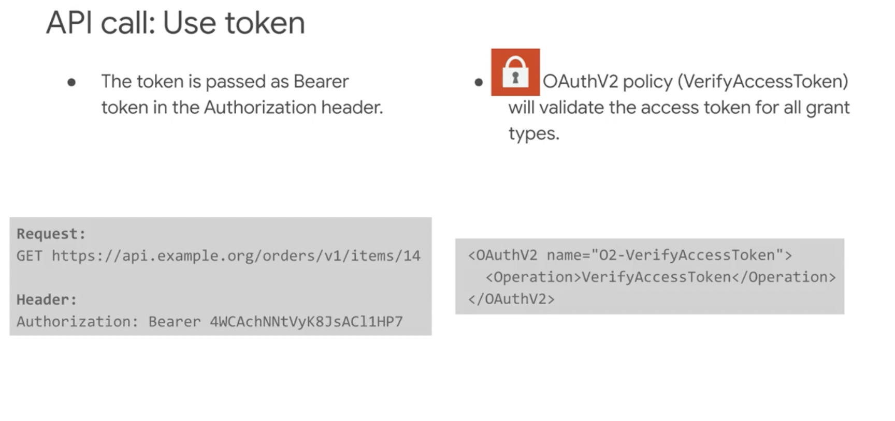

## Flow: Password Grant

Only highly-trusted applications can use the Resource Owner Password Flow (defined in [OAuth 2.0 RFC 6749, section 4.3](https://tools.ietf.org/html/rfc6749#section-4.3)), which requests that users provide credentials (username and password), typically using an interactive form. Because credentials are sent to the backend and can be stored for future use before being exchanged for an Access Token, it is imperative that the application is absolutely trusted with this information.

**The latest [OAuth 2.0 Security Best Current Practice](https://oauth.net/2/oauth-best-practice/) spec actually recommends against using the Password grant entirely, and it is being removed in the OAuth 2.1 update.**

### Password Grant flow without Apigee

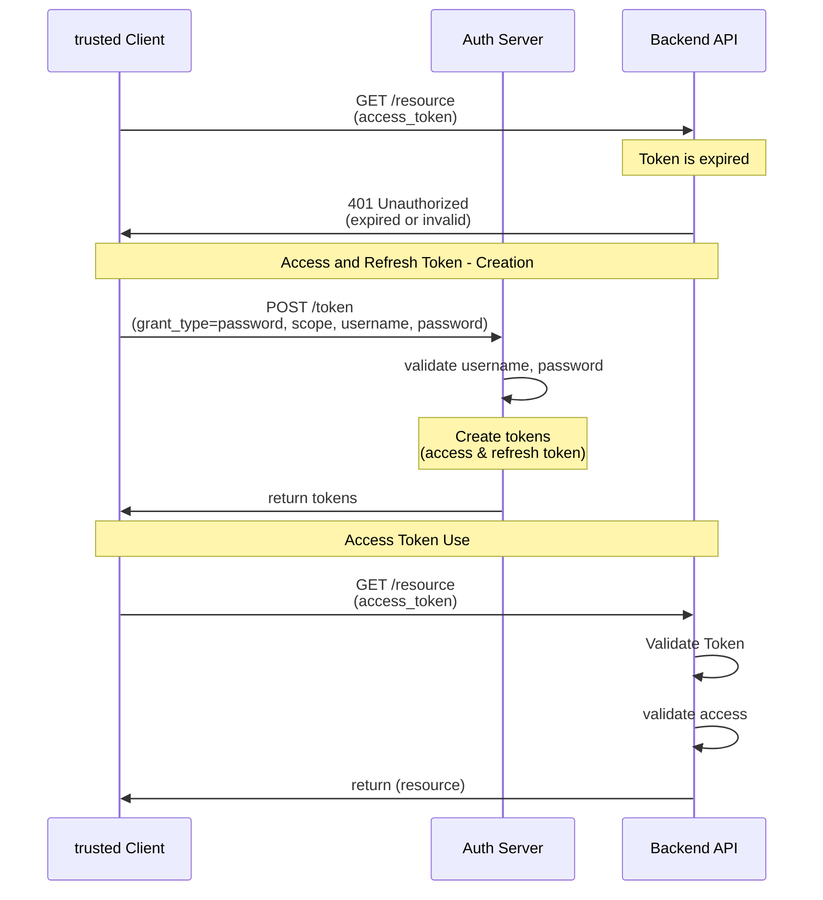

### Password Grant flow with Apigee

Orginal Apigee documentation: https://docs.apigee.com/api-platform/security/oauth/implementing-password-grant-type

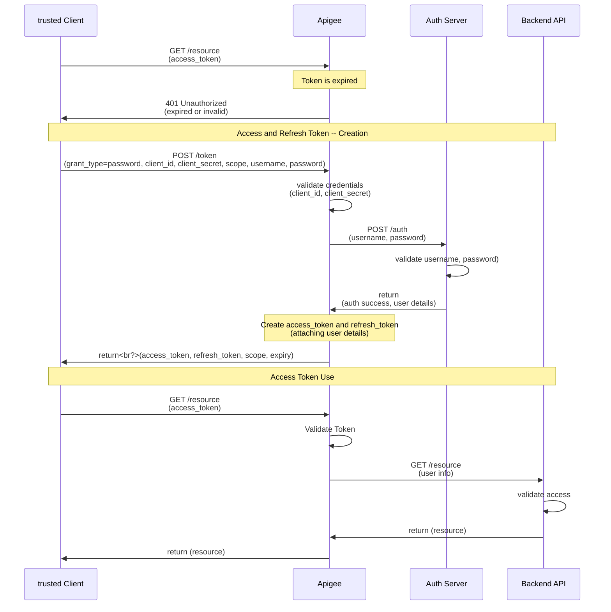

## Flow: [Authorization Code](https://oauth.net/2/grant-types/authorization-code/)

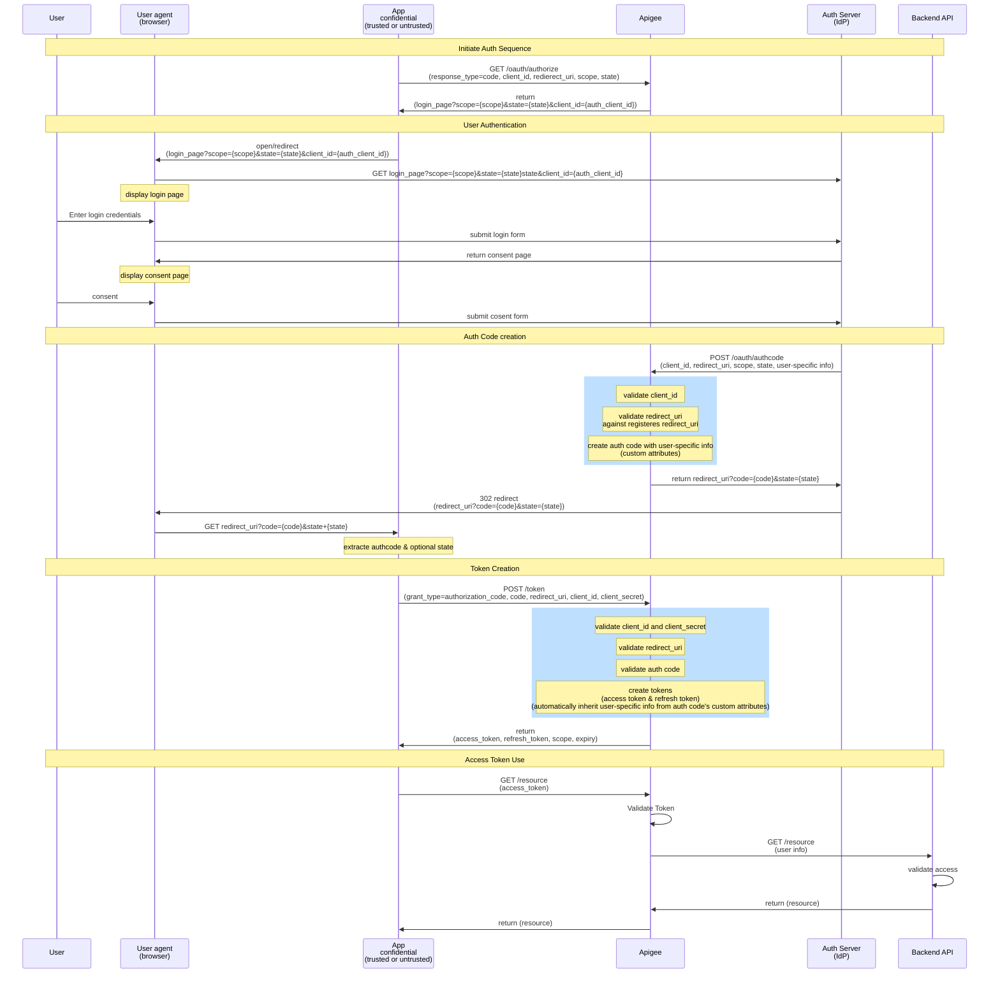

## Flow: Authorization Code with PKCE

- Use auth code for public clients
- Public clients cannot protect secrets.
- Auth code over https is safe, but mobile redirect with auth code may be compromised. How do we keep a compromised auth code from being exchanged for an access token?
- Proof Key for Code Exchange (PKCE):
	- Specified in RFC 7636
	- Uses cryptography to guarantee that the client exchanging the auth code for tokens also initiated the auth request

The problem with public clients is that they cannot safely store secrets. Mobile apps and client side JavaScript apps are examples of public clients.

The TLS communication used for OAuth is secure over the network, but the redirect on the mobile device may not be secure.

The redirect URL contains the auth code. If the auth code is compromised, how do we keep the bad actor from exchanging the auth code for an access token if we can't require a client secret?

The answer is that we use the OAuth extension called Proof Key for Code Exchange, known as PKCE. PKCE is specified in RFC 7636.

PKCE uses cryptography to guarantee that the client exchanging an auth code for tokens is the same client that started the original auth request.

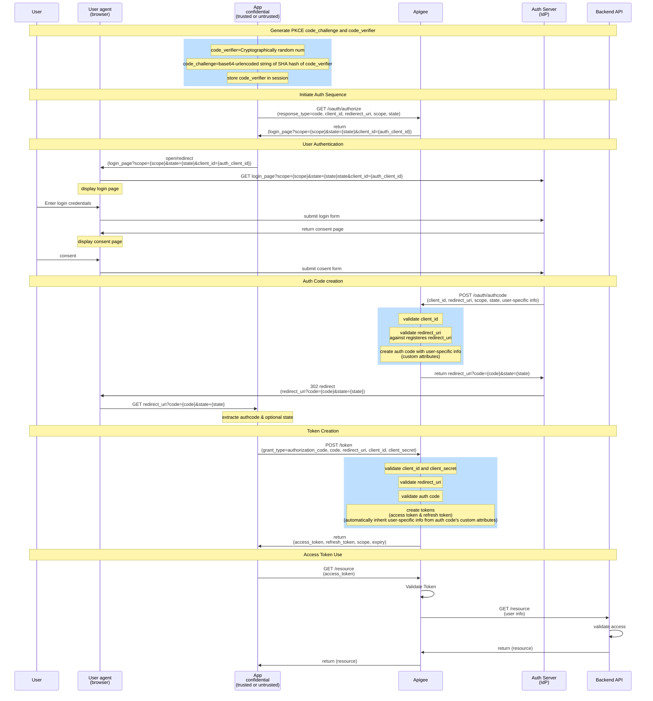

