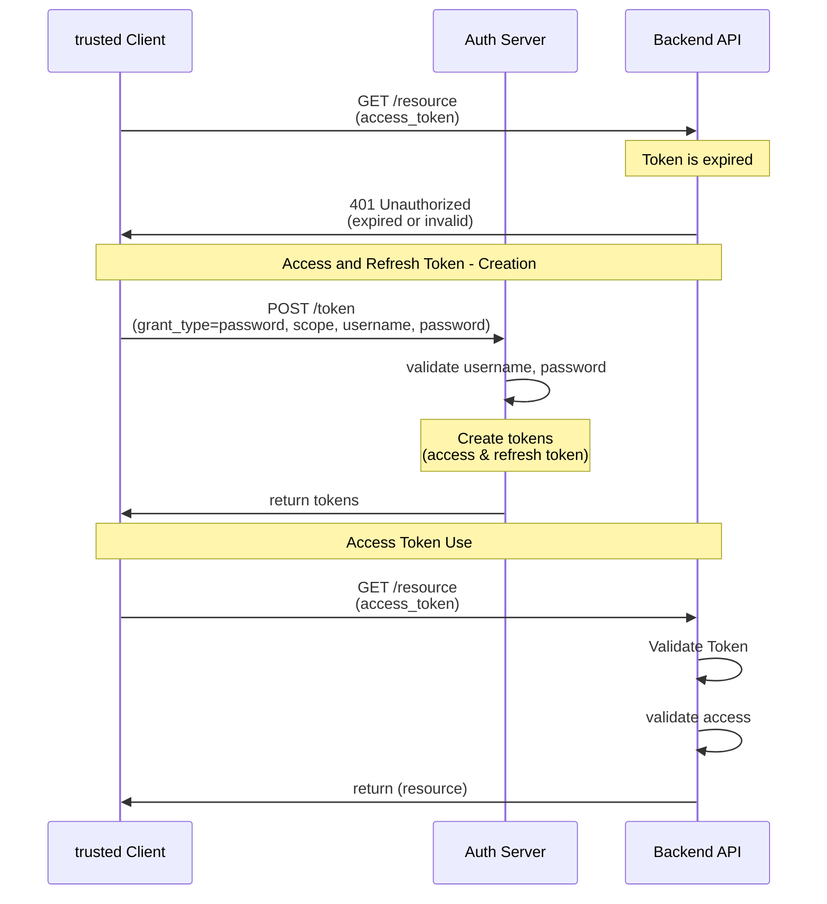
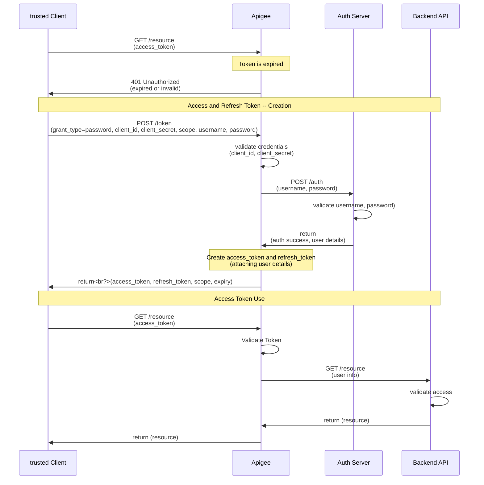

## Flow: Password Grant

Only highly-trusted applications can use the Resource Owner Password Flow (defined in [OAuth 2.0 RFC 6749, section 4.3](https://tools.ietf.org/html/rfc6749#section-4.3)), which requests that users provide credentials (username and password), typically using an interactive form. Because credentials are sent to the backend and can be stored for future use before being exchanged for an Access Token, it is imperative that the application is absolutely trusted with this information.

**The latest [OAuth 2.0 Security Best Current Practice](https://oauth.net/2/oauth-best-practice/) spec actually recommends against using the Password grant entirely, and it is being removed in the OAuth 2.1 update.**

### Password Grant flow without Apigee

### Password Grant flow with Apigee

Orginal Apigee documentation: https://docs.apigee.com/api-platform/security/oauth/implementing-password-grant-type

